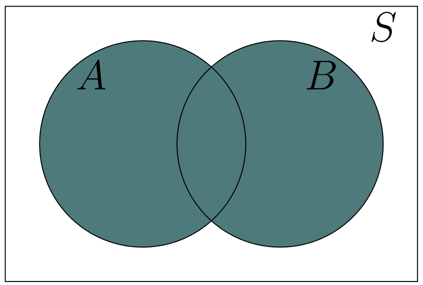
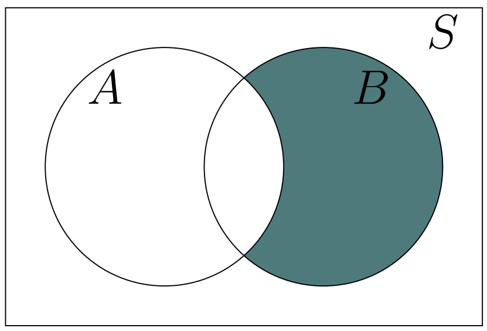

# Fundamentals of Probability and its Axioms

## Combinations and Permutations

Counting plays a fundamental role in probability. Many probability problems involve determining how many outcomes belong to certain sets. To do this, we use counting techniques such as **combinations** and **permutations**.

In probability, we work with a special set called the **sample space**, usually denoted by $S$ or $\Omega$, which contains all possible outcomes of a random experiment. Each individual outcome is denoted by $\omega \in S$.

An **event** is any ***subset*** of the sample space. That is, if $A$ is an event, then $A \subseteq S$. If $A$ contains all the elements of $S$, it is called an ***improper subset***; if it contains only some of the elements, it is a ***proper subset***, denoted $A \subset S$ .

Understanding how to count the number of outcomes in the sample space, or within specific events, is essential for calculating probabilities. 


**Example 1.1.** Suppose a fair coin is flipped twice.How many outcomes include at least one head?

**Solution:**

The sample space of this experiment can be expressed as
$S=\{HH,HT,TH,TT\}$. Now, consider the event:
$$A=\{\text{At least one outcome is a head}\}$$
Since $A=\{HH,HT,TH\},$ 3 outcomes include at least one head. Notice that $A\subset S$. 

From the previous example, it is clear that counting the number of
elements of sets is very important when dealing with discrete sets. We
will do this more efficiently by utilizing tools from combinations and
permutations.

### Permutations

We will begin by stating the following crucial theorem.

**Theorem 1.1: The Fundamental Principle of Counting**

Consider $k$ experiments. Let $n_i$ denote the number of possible
outcomes of the $i$th experiment where $i=1,2,\dots,k.$ Then the total
of number of possible outcomes is
$$n_1\times n_2\times\cdots\times n_k.$$
**Note (With Repetition):**

Consider $k$ experiments. Suppose that each experiment has the same number of possible outcomes, say $n$, and that the outcome of one experiment does not affect the outcomes of the others (i.e., repetition is allowed). Then the total number of possible outcomes is
$$
n \times n \times \cdots \times n = n^k.
$$

**Example 1.2.** A 6-sided die is rolled twice. How many possible
outcomes are there?

**Solution:**

First roll has 6 outcomes and the second roll has 6 outcomes. Therefore,
there are $6\times 6 = 36$ possible outcomes when a dice rolled twice.


**Example 1.3.** Suppose a password must contain exactly 4 symbols,
where each symbol is either a letter (a-z) or a number (0-9). How many
passwords can be created,

1.  if the password is not case-sensitive?
2.  if the first two symbols must be numbers?
3.  if the first two symbols must be numbers and the rest should be
    letters?

**Solution:**

1.  If the password is not case-sensitive, then there are
    $36\times36\times36\times36$ different passwords.
2.  If the first two symbols must be numbers, then there are
    $10\times10\times36\times36$ different passwords.
3.  If the first two symbols must be numbers and the rest should be
    letters, then there are $10\times10\times26\times26$ different
    passwords.

**Exercise 1.1.** Repeat the above example assuming the password is
case-sensitive.

**Example 1.4:** Suppose a password must contain exactly 4 symbols,
where each symbol is either a letter (a-z) or a number (0-9). How many
passwords contain at least one letter?

**Solution:**

Total number of passwords = $36^4$. Total number of passwords not
containing a letter = $10^4$. Therefore, the number of passwords
containing at least one letter is $$36^4-10^4$$

Imagine three objects labeled $A,B,$ and $C.$ The number of ways we can
arrange these objects is called a *permutation.* These objects can be
arranged in six different ways: $$ABC, ACB, BAC, BCA, CAB, CBA.$$ The
formula to find the number of permutations of $n$ *distinct* objects is
$$n!=n\times (n-1)\times\cdots\times 2\times 1.$$ For three distinct
objects, the number of permutations is $3!=6.$

**Example 1.5.** In a class, there are 4 sophomores, 7 juniors, and 3
seniors.

1.  How many ways are these students be arranged in a row?
2.  How many ways can these students be arranged if all the seniors
    should remain together?

**Solution:**

1.  $12!$
2.  Since the seniors must stand together, we think of the seniors as
    one \`\`block". Therefore, together with this block, 4 sophomores,
    and 7 juniors, there are 12 objects to be arranged. We can also
    arrange the three seniors within the block in $3!$ ways. Therefore,
    the total number of permutations is:

```{r ExPemut, echo = FALSE, out.width='80%', out.height='50%'}
knitr::include_graphics("class_example_permutations.png")
```

**Exercise 1.2.** How many ways can the students be arranged if students
from the same year should remain together?

**Exercise 1.3.** How many ways can the students be arranged if two
particular students do not wish to stand together?

**Exercise 1.4.** How many ways can the students be arranged if at most
two seniors should be together?

Now let's learn how to find the permutations of objects that are
non-distinct (some are identical). Consider the permutations of AAB.
Since we have two identical objects, the number of permutations has to
be less than $3!$ (since permuting the two A's gives us the same
arrangement).

**Theorem 1.2: Permutations of non-identical objects**

Consider a set of $n$ objects of which $n_1$ objects are alike, $n_2$
objects are alike, $\dots$, $n_k$ objects are alike. Then, the number of
permutations of these $n$ objects is given by
$$\frac{n!}{n_1!n_2!\cdots n_k!}$$

**Example 1.6.** Find the number of ways the following words can be
permuted:

1.  MATH
2.  BEEP
3.  COCO
4.  SUCCESS

**Solution:**

1.  4 different letters. Therefore, number of permutations: $$4!$$
2.  4 letters word, 2 letters are alike. Therefore, number of
    permutations: $$\frac{4!}{2!}$$
3.  4 letters word, 2 letters are alike and another 2 letters are alike.
    Therefore, number of permutations: $$\frac{4!}{2!2!}$$
4.  7 letters word, 3 letters are alike and another 2 letters are alike.
    Therefore, number of permutations: $$\frac{7!}{3!2!}$$

In each of the above questions, we make an adjustment for over-counting
by diving by the permutations of identical objects.

### Combinations

Combinations are the number of ways a subset can be chosen from a larger
set where the order of the selection does not matter. Consider a set of
$n$ distinct objects. The number of ways a subset of $r\leq n$ objects
can be chosen can be computed using the formula
$${n\choose r} = \frac{n!}{r!(n-r)!}$$ The key point here is that,
unlike in permutations, the order of the $r$ objects selected is
irrelevant.

**Example 1.7.** Suppose a shelf contains 10 distinct books out of which
4 are math books and the rest are physics books.

1.  How many ways can 3 books be chosen where the order does not matter?

2.  How many ways can 4 books be chosen so that exactly two are math
    books?

**Solution:**

1.  $10\choose 3$

2.  The number of ways two math books can be chosen = $4\choose 2$ The
    number of ways two other books (non-math) can be chosen =
    $6\choose 2$

Therefore, the total number of ways exactly two math books can be chosen
is $${4\choose 2}{6\choose 2}$$

**Exercise 1.5.** How many ways can at least one math book be chosen?

**Exercise 1.6.** How many ways can at most one math book be chosen?

Some questions in this course involves questions based on a deck of
cards. This is the composition of a deck of cards:

```{r ExCardDeck, echo = FALSE, out.width='90%', out.height='40%',fig.cap="Illustration of a standard deck of cards. Source: Missouri Western State University (https://intranet.missouriwestern.edu/cas/wp-content/uploads/sites/17/2020/05/Standard-Deck-of-Cards.pdf)"}

```

In the Figure`@ref(fig:ExCardDeck)`, the columns represent the different
**values** or **denominations** and the rows represent the four
**suits.** The last three values, Jack, Queen, and King are called
**face cards.**

**Example 1.8.** Consider a deck of 52 cards.

1.  How many ways can 5 cards be chosen?
2.  How many ways can 5 cards be chosen if exactly 2 cards must be
    Queens?
3.  How many ways can 5 cards be chosen if exactly 2 Queens and 2 Kings
    must be chosen?
4.  How many ways can we choose 5 cards such that exactly two have the
    same value?

**Solution:**

1.  $\binom{52}{5}$

2.  A deck of cards has 4 Queens. We first choose two Queens from the
    set of 4 Queens and 3 additional cards are chosen from the remaining
    48 cards (since 52-4 = 48). Therefore, the answer is
    $$\binom{4}{2}\binom{48}{3}$$

3.  $\binom{4}{2}\binom{4}{2}\binom{44}{1}$

4.  There are 13 different values in a deck of cards: Ace, 2, 3, ...,
    Q, K. Each value appears on 4 cards. To choose two cards from the
    same value, we first pick a value. This can be done in
    $\binom{13}{1}=13$ ways. Thereafter, we choose 2 cards from the 4
    cards of this chosen value. This can be done in $\binom{4}{2}$ ways.
    Now we choose 3 additional cards that are different from this value.
    However, we also must make sure that we do not pick more than one
    card from another value. Out of the 12 values left, we first choose
    three values ($\binom{12}{3}$ways), and then from each value, we
    choose a card ($\binom{4}{1}^3=4^3$ ways). Therefore, the final
    answer is $$13\cdot\binom{4}{2}\cdot \binom{12}{3}\cdot 4^3$$

**Exercise 1.7.** How many ways can five cards be chosen such that all
the values are unique?

**Exercise 1.8.** How many ways can five cards be chosen such that two
cards are of one value and three cards of another value? (For example,
QQAAA,22299,etc.).

### Worked Examples

1.  How many different ways can 5 cards be chosen from a deck of 52 if
    exactly two of the cards are of the same value and the other three
    cards are of different values? (Example: AA5JQ, 66KQ2, etc.)

2.  How many ways can 5 cards be chosen from a standard 52-card deck if
    all 5 cards must have different values? (Ex: A2JQ3, 7J2Q4, etc.)

3.  A class consists of 40 seniors and 60 juniors. The teacher wants to
    form a committee consisting of 4 seniors and 6 juniors.

    a.  How many ways can the committee be formed?
    b.  How many ways can the committee be formed if two specific
        seniors do not wish to serve on the committee together?
    c.  Greg is one of the seniors in the class. How many different
        committees can be formed that include Greg as a member?

4.  Ten identical pieces of candy are to be distributed between four
    students - A,B,C,and D.

    a.  How many ways can the candy be distributed?
    b.  How many ways can the candy be distributed if $A$ must receive
        exactly two pieces?
    c.  How many ways can the candy be distributed if A must receive at
        least two pieces?

5.  All the cards of deck of 52-cards are arranged in a line.

    a.  How many ways can the cards be arranged such that the colors
        (red and black) alternate?
    b.  How many ways can the cards be arranged if not all four Queens
        are together?

**Solution:**

1.  A standard deck of cards has 13 different values. We need to first
    choose a value and then pick two cards from that value. Since each
    value has 4 cards, we can do this in $\binom{13}{1}\binom{4}{2}$
    ways. Thereafter, the other three cards must be picked from three
    other values. Since we have already picked 2 cards from one of the
    values, there are 12 values left to choose from. We first pick 3
    values and then choose a card from each value. This can be done on
    $\binom{12}{3}\binom{4}{1}\binom{4}{1}\binom{4}{1}$ ways. Therefore,
    the final answer is
    $$\binom{13}{1}\binom{4}{2}\binom{12}{3}\binom{4}{1}\binom{4}{1}    \binom{4}{1}$$

2.  This is a little bit similar to the previous problem, but here we
    have to choose 5 distinct values. We first choose 5 values and then
    from each value, we pick a card. Therefore, the final answer is
    $$\binom{13}{5}\binom{4}{1}\binom{4}{1}\binom{4}{1}\binom{4}{1}\binom{4}     {1}=\binom{13}{5}\cdot 4^5$$

3.  a\. $\binom{40}{4}\binom{60}{6}$

    b\. We will find the answer to this using an indirect method. Let's
    first find the number of committees where the two specific students
    \textit{are} together. The set of seniors consists of these 2
    specific students and 38 other seniors. The number of ways we can
    choose 4 seniors where two specific students are always included in
    the committee is $\binom{2}{2}\binom{38}{2}=\binom{38}{2}.$ Since
    there are no restrictions for the juniors, the total number of
    committees where these two specific students are in the committee is
    $\binom{38}{2}\binom{60}{6}.$ Since the total number of committees
    is $\binom{40}{4}\binom{60}{6}$ (this is what we found in part (a)),
    we can find the answer to this question by subtracting the number of
    committees where the two students are together from the total number
    of committees (this gives us the number of committees where only one
    of them are together or none of them are in the committee):
    $$\binom{40}{4}\binom{60}{6}-\binom{38}{2}\binom{60}{6}$$

c\.
$$\binom{1}{1}\binom{39}{3}\binom{60}{6}=\binom{39}{3}\binom{60}{6}$$
4. a. Let's use $X$ to represent a piece of candy. We can use three
lines (dividers) to divide the candy between the three students. For
example $$X|XX|XXX|XXXX$$ means A gets 1, B gets 2, C gets 3, and D gets
4. Similarly, $$X||XX|XXXXXXX$$ means A receives 1, B receives none, C
receives 2, and D receives 7. Therefore, we can find the total number of
distributions by finding the total number of arrangements of the Xs and
the lines. Since there are 10 Xs and three lines, but the 10 Xs are
identical and the 3 lines are identical (total 13 objects), the total
number of ways the candy can be distributed is
$$\frac{13!}{3!10!}=\binom{13}{3}$$

b.  $$\underbrace{XX}_{A\text{ receives 2 
     }}\underbrace{XXXXXXXX}_{\text{Distribute the rest between B,C,D}}$$
    This problems simplifies to 8 pieces of candy and three students -
    B,C,D. To distribute between 3 students, we need 2 lines. Therefore,
    the total number of distributions is
    $$\frac{10!}{2!8!}=\binom{10}{2}$$

c.  This is similar to the previous part. Initially, we give A two
    pieces of candy. However, when we distribute the other 8 pieces of
    candy, we distribute between all the 4 students. This way, A gets at
    least 2. $$\underbrace{XX}_{A\text{ receives 2 
     }}\underbrace{XXXXXXXX}_{\text{Distribute the rest between A,B,C,D}}$$
    Therefore, we have 8 Xs and 3 lines (total 11). The answer is
    $$\frac{11!}{3!8!}=\binom{11}{3}$$ 5.a. We can arrange the cards
    starting with a red card (RBRB...) or with a black card (BRBR...).
    Since there are 26 red cards and 26 black cards, the answer is
    $$ 26!26!\cdot2$$ b. The total number of arrangements without any
    restrictions is 4!. The number of ways we arrange the cards keeping
    \textit{all} the queens together is $4!49!$ (48 other cards + one
    block of 4 queens = 49 objects). Therefore, the number of
    arrangements where at least one queen is separated is $$52!-49!4!$$

## Review of Set Theory

**Intersection of Two Sets A and B**

The intersection of two sets, denoted by $A \cap B$ and read as "$A$
intersection $B$", consists of all elements that are common to both $A$
and $B$.

```{r intersec, echo = FALSE, out.width='50%', out.height='40%', fig.cap="Intersection of Two Sets $A$ and $B$"}
knitr::include_graphics("Ven1.png")
```

**Union of Two Sets A and B**

The union of two sets, denoted by $A \cup B$ and read as "$A$ union
$B$", consists of all elements in $A$ or $B$ or both.

```{r unio, echo = FALSE, out.width='50%', out.height='40%', fig.cap="Union of Two Sets $A$ and $B$"}

```

**Complement of an Event A**

The complement of an event, denoted by $A^c$ and read as "complement of
$A$", consists of everything not in $A$, relative to the universal set
$S$.

```{r compl, echo = FALSE, out.width='50%', out.height='40%', fig.cap="Complement of an Event A"}
knitr::include_graphics("Ven3.png")
```

**A Subset of an Event**

$A$ is a subset of an event $B$, denoted by $A \subseteq B$ and read as
"$A$ is a subset of $B$", when every element of event $A$ is in event
$B$.

```{r subs, echo = FALSE, out.width='50%', out.height='40%', fig.cap="Subset of an Event"}
knitr::include_graphics("Ven4.png")
```

**Set Difference**

$A$ difference $B$, denoted by $A-B$ and read as "$A$ minus $B$",
consists of elements in $A$ that are not in $B$.

```{r AminB, echo = FALSE, out.width='50%', out.height='40%', fig.cap="Set Difference: A-B"}
knitr::include_graphics("Ven5.png")
```

As in Figure`@ref(fig:AminB)`, $A-B=A \cap B^c.$

$B$ difference $A$, denoted by $B-A$ and read as "$B$ minus $A$",
consists of elements in $B$ that are not in $A$.

```{r BminA, echo = FALSE, out.width='50%', out.height='40%',fig.cap="Set Difference: B-A"}

```

As shown in Figure`@ref(fig:BminA)`, $B-A=B \cap A^c.$

## Laws of Set Theory

**Commutative Laws**

 1. $A \cup B = B \cup A$
 2. $A \cap B = B \cap A$

**Associative Laws**

 1. $(A \cup B) \cup C = A \cup (B \cup C)$
 2. $(A \cap B) \cap C = A \cap (B \cap C)$

**Distributive Laws** 

 1. $A \cap (B \cup C) = (A \cap B) \cup (A \cap C)$
 2. $A \cup (B \cap C) = (A \cup B) \cap (A \cup C)$

**De Morgan's Laws** 

1.  $(A\cup B)^c = A^c \cap B^c$
2.  $(A\cap B)^c = A^c \cup B^c$

## Axioms of Probability

Let $S$ be a sample space. A probability measure $P$ is a set function
that satisfies the following axioms, known as **Kolmogorov's Axioms of Probability**:

1.  $P(S)=1.$
2.  $P(A)\geq 0 \mbox{ for any event } A$.
3.  $\mbox{If } A_1,A_2,... \mbox{ is a sequence of mutually exclusive events (i.e. } A_i\cap A_j = \mbox{ for all } i\neq j\mbox{), then }$
    $$P\left(\bigcup_{i=1}^{\infty}A_i\right)=\sum_{i=1}^{\infty}A_i.$$

**Theorem 1.3: Basic Properties of Probability Theory**

1.  $P(\emptyset)=0$
2.  $P(A^c)=1-P(A)$
3.  $P(A-B) = P(A)-P(A\cap B)$
4.  $\mbox{If }A\subset B, \mbox{ then } P(A)\leq P(B)$
5.  $P(A\cup B)=P(A)+P(B)-P(A\cap B)$

**Proof:** We will leave 4 and 5 as exercises.

1.Observe that $\emptyset \cap S = \emptyset$ and
$\emptyset \cup S = S.$ Therefore,
$$1=P(S)=P(\emptyset \cup S)=P(\emptyset)+P(S)=P(\emptyset)+1\implies P(\emptyset)=0$$
2.Observe that $A^c\cup A = S$ and $A^c\cap A = \emptyset$. Therefore,
$$1=P(S)=P(A^c\cup A)=P(A)+P(A^c)\implies P(A^c)=1-P(A)$$ 3.Observe
that $(A-B)\cup (A\cap B)=A$ and $(A-B)\cap (A\cap B)=\emptyset.$
Therefore,
$$P(A)=P((A-B)\cup (A\cap B))=P(A-B)+P(A\cap B)\\ \implies P(A-B) = P(A)-P(A\cap B)$$
**Example 1.9.** $P(A)=0.4, P(B)=0.5,P(A\cap B)=0.1.$ Find the following
probabilities:

1.  $P(A^c)$
2.  $P(A\cup B)$
3.  $P(A\cap B^c)$
4.  $P(A\cup B^c)$
5.  $P(A^c\cap B^c)$

**Solution:**

1.  $P(A^c)=1-P(A) = 1-0.4 = 0.6$
2.  $P(A\cup B)=P(A)+P(B)-P(A\cap B)=0.4+0.5-0.1 = 0.8$
3.  $P(A\cap B^c)=P(A-B)=P(A)-P(A\cap B)= 0.4-0.1=0.3$
4.  $P(A\cup B^c)=P(A)+P(B^c)-P(A\cap B^c)=0.4+(1-0.5)-0.3 = 0.6$
5.  We use De Morgan's law for this:
    $$P(A^c\cap B^c)=P((A\cup B)^c)=1-P(A\cup B )=1-0.8 = 0.2$$

### Sample spaces with equally likely outcomes

Consider the sample space $S=\{a_1,a_2,\dots,a_N\}.$ If all these
outcomes are equally likely, then
$$P(\{a_1\})=\cdots=P(\{a_N\})=\frac{1}{N}$$

If $A$ is any event in $S,$ then $$P(A) = \frac{|A|}{|S|},$$ where $|A|$
denotes the number of outcomes in $A.$

This method of computing the probability of an event, while very
useful, is not always suitable for the following reasons:

1.  Each outcome has to be equally likely.
2.  The sets must be countable.

**Example 1.10.** Suppose a fair die is rolled twice.

1.  Find the probability of rolling a double.
2.  Find the probability of rolling a sum of 5.

**Solution:**

1.  $A=\{\text{a double is rolled}\}=\{(1,1),(2,2),(3,3),(4,4),(5,5),(6,6)\}$
    Since $|S|=36$ and $|A|=6,$ $$P(A)=\frac{6}{36}=\frac{1}{6}$$

2.  $A=\{(1,4), (2,3),(3,2),(4,1)\}$ $$P(A)=\frac{4}{36}=\frac{1}{9}$$

**Exercise 1.9.** Four cards are randomly picked from a deck of 52
cards. Find the probability of the following events.

1.  Exactly one card is a Queen.

2.  At least one card is a Queen.

3.  At least one card is a Queen or exactly two cards are Kings.

**Solution:**

1.  Let's first find out what $|S|$ is. To figure out the size of the
    sample space, it's vital to understand what the "experiment" is. We
    are drawing four cards from the deck. How many ways can we do that?
    $$|S|=\binom{52}{4}$$ Now define
    $Q_1 = \{\text{exactly one card is a Queen}\}$. Then
    $$|Q_1|=\binom{4}{1}\binom{48}{3}$$ Therefore,
    $$P(Q_1)=\frac{\binom{4}{1}\binom{48}{3}}{\binom{52}{4}}$$
2.  Let $Q=\{\text{at least one card is a Queen}\}.$ Then
    $Q^c=\{\text{no Queens are picked}\}.$ Notice that
    $$P(Q^c)=\frac{\binom{48}{4}}{\binom{52}{4}}$$
    Therefore,$$P(Q)=1-P(Q^c)=1-\frac{\binom{48}{4}}{\binom{52}{4}}$$
3.  Let $Q_1 = \{\text{exactly one card is a Queen}\}$ and
    $K_2 = \{\text{exactly two cards are Kings}\}.$ Then the probability
    that $Q_1$ occurs of $K_2$ occurs is
    $$P(Q_1\cup K_2)=P(Q_1)+P(K_2)-P(Q_1\cap K_2)=\frac{\binom{4}{1}\binom{48}{3}}{\binom{52}{4}}+\frac{\binom{4}{2}\binom{48}{2}}{\binom{52}{4}}-\frac{\binom{4}{1}\binom{4}{2}\binom{44}{1}}{\binom{52}{4}}$$

**Exercise 1.10.** The 26 letters of the alphabet are arranged in a
line. What is the probability that the word MATH appears consecutively
in that order somewhere in the arrangement?

We are arranging all 26 letters in a line. How many ways can we do this?
26! Therefore, $|S|=26!$ Now let's figure out how many ways we can
arrange the 26 letters where the block of letters MATH appears together
exactly in this order. Let's think of the block "MATH" as one object,
and together with the other 22 letters, we have 23 objects. Therefore,
the probability is $$\frac{23!}{26!}$$

### Worked Examples

1.  Two cards are randomly selected from a deck of cards. What is the
    probability that they form a blackjack? That is, what is the
    probability that one of the cards is an ace and the other one is
    either a ten, a jack, a queen, or a king?
2.  A fair die is rolled 4 times. What is the probability that a "6" is
    observed at least once?
3.  In a class of 35, what is the probability that at least two students
    will share the same birthday? Ignore leap years.
4.  A die is rolled three times. What is the probability that all three
    rolls result in different numbers?

**Solution:**

1.  The number of ways a single ace can be chosen is $\binom{4}{1}.$ To
    form a blackjack, the other card has to be a ten, a jack, a queen,
    or a king. There are 16 such cards in a deck. Therefore, the
    probability of forming a blackjack is
    $$\frac{\binom{4}{1}\binom{16}{1}}{\binom{52}{2}}$$

2.  If a die is rolled four times, the total number of possible outcomes
    if $6^4.$ This is a number of outcomes in the sample space. 
    Now let's define some events:

    $A=\{\mbox{at least one 6 is observed}\}$

    $A^c=\{\mbox{no 6s are observed}\}$

    It is easier to compute $P(A^c)$ directly than $P(A).$ The number of
    ways a die can be rolled four times such that a "6" does not appear
    is $5\times 5\times 5\times 5 = 5^4$ (we can roll any one of the
    numbers 1,2,3,4, or 5, but not a 6). Therefore,

    $$P(A^c)=\frac{5^4}{6^4}.$$It follows that
    $$P(A)=1-P(A^c)=1-\left(\frac{5}{6}\right)^4$$

3.  There are various ways to rephrase this question. Suppose each
    student randomly selects a number between 1 and 365. What is the
    probability that at least two students will pick the same number?
    Another way to think of this problem is, suppose there is a die with
    365 sides and you roll it 35 times. What is the probability that the
    same number is rolled at least twice? Whichever way you prefer to
    rephrase this question, the answer remains the same. Let's defined
    some events:

    $A=\{\mbox{at least two students share the same birthday}\}$

    $A^c=\{\mbox{all birthdays are unique}\}$

    The number of elements in the sample space is the total outcomes
    possible when each student gets to pick a number between 1-365.
    Therefore, $|S|=365^{35}.$ Next, the number of outcomes possible
    where no student picks the same number is
    $$365\times 364\times\cdots\times 331 = \frac{365!}{330!}$$

    Therefore,
    $$P(A^c)=\frac{\frac{365!}{330!}}{365^{35}}=\frac{365!}{330!365^{35}}.$$
    Hence, $$P(A)=1-\frac{365!}{330!365^{35}}\approx 0.866$$

4.  $$\frac{6\cdot 5\cdot 4}{6^3}= \frac{5}{9}$$
